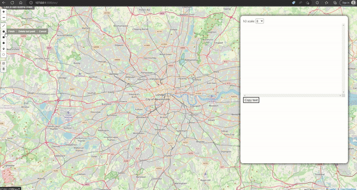

# Leaflet Dashboard Template by Rekayasa Data Spasial


initial template for leaflet desktop app. This should be the infrastructure to create web-gis application by [Rekayasa Data Spasial](https://tentang.rekayasadata.co.uk) and [RekayasaData.co.uk](https://rekayasadata.co.uk/). This is a public repo so feel free to fork or extend this template. thanks.

## H3 Coverage Indexer

Draw polygons and generate h3 compact indices.



## Installation

Require npm and node just to install the static modules.

```bash 
git clone $url dashboard
cd dashboard
npm install
cd src
python -m http.server
```

## Intention

what can you do with this template?

1. checkout to create extensions / apps. checkout name is arbitrary, doesn't have to be ```application```

```bash
git checkout -b application
```

2. on this new branch, add another git remote. doesn't have to be ```extendedapp```

```bash
git remote add extendedapp 
```

3. start developing, commits, and push to new repo / remote. Push to the aforementioned ```application``` branch and ```extendedapp``` remote.

```bash
git push extendedapp application
```

## Preview

